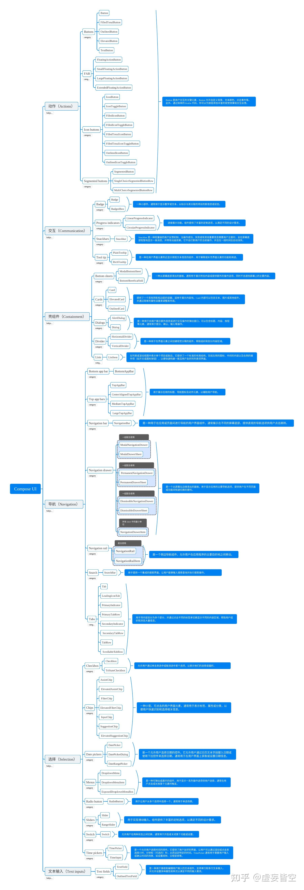

# 西二在线 Android 第四轮考核：自定义 View 和 Compose

## 一、知识点

* 自定义 View
* 三大动画
* lambda 函数
* Compose 初步

## 二、参考教程

* 自定义 View/动画教程：https://rengwuxian.com/
* Compose 布局/动画教程：安卓官方，在谷歌上中文搜索 jetpack compose 即可，比如动画教程：https://developer.android.com/jetpack/compose/animation?hl=zh-cn
* Compose 控件大全:
   1. https://composables.com/
   2. https://jetpackcompose.cn/docs/
   3. 见文末.

## 三、考核内容

* 实现一个可以检测左右滑动，自动回调的自定义 view 控件，作为 recyclerView 的子 view。（也就是实现列表滑动删除的功能），回调功能使用 lambda 函数功能实现。要求删除过程中应该有适当的动画。
* 实现一个展示数据的统计图控件，支持接收一个二维数组然后展示数据（以条形统计图/折线图的形式），数据改变时调用该控件的刷新方法更新数据，控件能够使用动画的方式改变展示的数据。

## 四、注意事项

* 推荐两种控件一个用 Compose，一个用自定义 View，先看自己熟悉的布局编写方法。
* 两种方法都用会加分。

---
